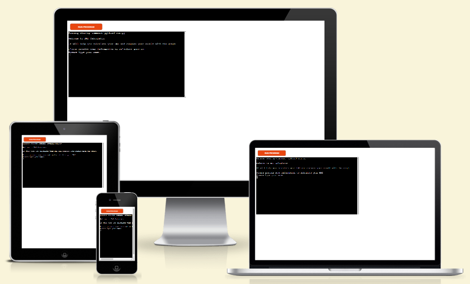

# BMI Calculator

Welcome to BMI Calculator. Simple program which help you check your BMI. Program will ask for some information about you and then calculate your BMI.

The life link can be found here: [bmi-calculator](https://calculate-your-bmi-50a851f64fcf.herokuapp.com/)

## How to use it
- The program will asked questions of some information about user 
- After each question if the answer will not be valid, user get information on the screen
- When all the information provided by user will be valid the program will calculate the BMI
- The result will be displayed on the screen for the user with a short message

## Site owner goal
- Provide user with simple BMI calculator
- Give user feedback about result

## Logic Flow

provide diagram

## Features

### Existing Features
- Calculate User Age
    - This function calculate user age to store it in the workseet

 - Calculate BMI
    - User provide the weight and height
    - This function calculate user BMI by provided user data

  - Display result to the user
    - User get a calculated result of BMI
    - User also get a short message from the program acording to the BMI result

   - Updating the API
    - Store the user information in Google Sheets

 ### Future Features
- The login and password screen could be created for users and after when they login they will be able to see the last calculation.
- Time stamp could be also added for the user's so when they come back they could see when was the lst they check their BMI
- All the infromation could be transfer from wordsheet to a database
- Site owner could create a report about how many people take it the calculation of BMI, what's the average user age and etc.

## Data Model
The program collect the inforation from the user.
The information have to get through the validation process

Some of the information are used to complete the program requirements.
The program requirements are to calculate user BMI and store those data into Google Sheets API.

The data model is quite simple. Each action is write in seperate deffinitions that will be easy to manage and maintain if something goes wrong.

## Testing
- The project was tested manually by me, my familly and closes friends on desktop, tablets and phones.
- It was also tested in PyCharm terminal, the codeanywhere terminal when writting the project and on Heroku terminal.

### Input Testing
All user inputs were tested and check for validation as follow:
     - User name input - tested for numbers in user name, if user name is empty, is it at least 2 chars long and is it match the given pattern provided by regex. If any of the condition will be invalid the user will get a message on the screen
     - Email - for this validation is used outside library called email_validator which check if given email match the pattern in that library and will give user feedback if not
     - Gender - simple validation to check if the user is Male(M) or Female(F). In any other cases user will get an error
     - Weight and Height - validation to check if the given input is a number grteater than 0. This is possible because input which user provide is casted to float from string value.
     - Date of Birth - date validation is check by regex and pattern provided by the site owner. If date won't be in given format dd/mm/yyy the user will get an error on the screen e.g. if user type in '-' between numbers instead of '/'

### Validator Testing
- PEP8
    - Passed the PEP8 validation with no errors found on run.py.
    

### Bugs

#### Solved Bugs

- When calculating the user age I found out that the first approach which I have doesn't calculate the months and days correctly e.g. when user birthday was the next day of today it was still counted like the user is already a plus year old. It goes by the year, not including the months and days. The second solution which I found online sole the problem. I credited the source below in Credit section.
- I decided to use external python library email_validator instead of regex for email validation. It's designed for this purpose and shorter to write than regex expesion which sometimes didn't catch the wrong email.

## Deploy

The application is deployed on Heroku platform (which is used for backend project) using Code Institute mock terminal.
To achive that the following steps have to be taken
 - Copy the repository
 - Create a Heroku Application

## Library and technology used

### Python Libraries

- re - re.match() is used to check the user name and user date of birth match the given pattern
- email_validator - check if email address have correct syntax and handle the error if not
- datetime - datetime.now() get todays date for calculation of user age
- gspread - help communicate with google sheets

### Program Used

- GitHub - version control
- Heroku - deploy the live project
- Codeanywhere - build up the application
- PyCharm - for testing

## Credits

### Resources Used

- [Stack Overflow - Python RegEx](https://stackoverflow.com/)
- [W3Schools](https://www.w3schools.com/python/python_regex.asp) - used to learn about RegEx
- [Python Docs - regular expression](https://docs.python.org/3/library/re.html) - used to learn about RegEx and used it in name validation
- [GeeksForGeek](https://www.geeksforgeeks.org/python-validate-string-date-format/) - used this article to learn about date validation in python
- [How to calculate age in Python - codingem.com](https://www.codingem.com/how-to-calculate-age-in-python/) - used this article to learn how to calculate the age in python 
- [Am-I-Responsive](https://ui.dev/amiresponsive) - check my progrtam on different devices
- I followed the steps in the Code Institute Python walkthrough project - Love Sandwiches when setting up my Google Sheets API.

## Acknowledgments

My mentor Antonio Rodriguez for help and ideas about the project
The slack community on Code Institute chanel, they are always there if you need help.