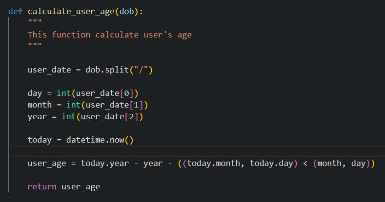

# BMI Calculator

Welcome to BMI Calculator. Simple program which help you check your BMI. Program will ask for some information about you and then calculate your BMI.

The life link can be found here: [BMI Calculator](https://calculate-your-bmi-50a851f64fcf.herokuapp.com/)

## How to use it

- The program will asked questions about user 
- After each question, if the answer will not be valid, user get information back on the screen
- When all the information provided by user will be valid the program will calculate the BMI
- The result will be display on the screen with a short message for the user

## Site owner goal

- Provide user's with simple BMI calculator
- Give user's feedback about result

## Logic Flow

For better understanding of program flow I provide a flow chart diagram which give the idea of how program works.
I creat it using draw.io - online free tool for simple flow charts diagrams and more

## Features

### Existing Features
- Calculate User Age
    - This function calculate user age usig datetime library

    

 - Calculate BMI
    - This function calculate user BMI in metric system
    - User's provide the weight and height through the questions they have to answer at the beggining of the application

   

  - Display result to the user
    - User get a calculated result of BMI
    - User also get a short message from the program acording to the BMI result

    

   - Save data to the API
    - Store the user information in Google Sheets API

    

 ### Future Features

- The login and password screen could be created for users and after when they login they will be able to see the last calculations.
- Time stamp could be also added for the user's so they know when was the last time they checked their BMI
- All the infromation could be transfer from wordsheet to a database
- Site owner could create a report about how many people take it the calculation of BMI, what's the average user age and etc.
- The program could create a report for the user's about they historical BMI values

## Data Model

The program collect the inforation from the user.
The information have to get through the validation process

Some of the information are used to complete the program requirements.
The program requirement is to calculate user BMI and store those data into Google Sheets API.

Each action is writen in seperate deffinitions that will be easy to manage and maintain if something goes wrong.

## Testing

The project was tested manually by myself, my familly and closes friends on desktop, tablets and phones.
It was also tested in PyCharm terminal, the CodeAnywhere terminal when writting the project and on Heroku when application was deployed.

### Input Testing

All user inputs were tested and check for validation as follow:
- User name input - tested for numbers in user name, if user name is empty, is it at least 2 chars long and is it match the given pattern provided by regex. If any of the condition will be failed the user will get a message on the screen
- Email - for this validation I used outside library called email_validator which check if given email match the pattern in that library and will give user feedback if not
- Gender - simple validation to check if the user is Male(M) or Female(F). In any other cases user will get an error
- Weight and Height - validation to check if the given input is a number grteater than 0. This is possible because input which user provide is cast to float from string value.
- Date of Birth - date validation is check by regex and pattern provided by the site owner. If date won't be in given format dd/mm/yyyy the user will get an error on the screen e.g. if user type in '-' between numbers instead of '/' the rror will shop up on the screen

### Validator Testing

- PEP8
    - Passed the PEP8 validation with no errors found on run.py.

    

### Bugs

No bugs founded

### Solved Bugs

- When calculating the user age I found out that the first approach which I have doesn't calculate the months and days correctly e.g. when user birthday was the next day of today it was still counted like the user is already a plus year old. It goes by the year, not including the months and days. The second solution which I found online sole the problem. I credited the source below in Credit section.
- I decided to use external python library email_validator instead of regex for email validation. It's designed for this purpose and shorter to write than regex expesion which sometimes didn't catch the wrong email.

## Deployment

The aplication is deployed on [Heroku](https://dashboard.heroku.com/apps) platform and the live link can be found here --> [BMI Calculator](https://calculate-your-bmi-50a851f64fcf.herokuapp.com/)

But before that a command pip3 freeze > requirements.txt

To achive that the following steps have to be taken:
 - Create a repository on GitHub acoount using Code Institute pp3 template
 - In Codeanywhere create a new workspace
 - Write the application logic
 - Push changes to github
 - Test the application in terminal for bugs and errors
 - Use the command pip3 freeze > requirements.txt in terminal to store all the requirements of application into file (this is needed so the heroku know what requirements have to load it while deploy the apllication)
 - Create or log in to Heroku account
 - In Heroku dashboard click "Create -> Create New App"
 - Follow the steps to create your app (add unique name, choose the region)
 - Next click on Setting tab and scroll down to Config Vars
 - Click "Reveal Config Vars" and Enter first Config Var KEY: PORT, and the VALUE: 8000, then press "Add"
 - Then in The second KEY type CREDS and for VALUE copy and paste the content of the creds.json file from the project if you create it
 - Next scroll down to the Buildpack section and click "Add Buildpack", select python, click "Add", then select nodejs and click "Add"
 - Make sure that python is abowe node.js, if not click and hold the burger menu on the left hand side of the python/node.js and move them in correct order
 - Move to the top of the page and click Deploy tab
 - Select GitHub as a deployment method
 - Confirm that you want to connect with GitHub
 - Find your repository name on the screen and click the connect button
 - Move down the page and know you have two options to choose
    - you can click "Enable Automatic Deploy" in Automatic Deplos section which will run every time you make a change to your project through GitHub
    - or you can choose "Deploy Brach" in Manual Deploy section. Remember that you will have to run this everytime you make a change to your project
- Click "View" to see the deployed project    

## Library and Technology Used

### Python Libraries

- re - re.match() is used to check the user name and user date of birth match the given pattern
- email_validator - check if email address have correct syntax and handle the error if not
- datetime - datetime.now() get todays date for calculation of user age
- gspread - help communicate with google sheets

### Program Used

- GitHub - version control
- Heroku - deploy the live project
- Codeanywhere - build up the application
- PyCharm - for testing

## Credits

### Resources Used

- [Stack Overflow](https://stackoverflow.com/)
- [W3Schools - Python RegEx](https://www.w3schools.com/python/python_regex.asp) - used to learn about RegEx
- [Python Docs - regular expression](https://docs.python.org/3/library/re.html) - used to learn about RegEx and used it in name validation
- [Python validate string date format - GeeksForGeek](https://www.geeksforgeeks.org/python-validate-string-date-format/) - used this article to learn about date validation in python
- [How to calculate age in Python - codingem.com](https://www.codingem.com/how-to-calculate-age-in-python/) - used this article to learn how to calculate the age in python 
- [Draw.io](https://app.diagrams.net/) - used this tool to create a flow chart diagram for application
- [Am-I-Responsive](https://ui.dev/amiresponsive) - check program on different screen devices
- I followed the steps in the Code Institute Python walkthrough project - Love Sandwiches - when setting up my Google Sheets API.

## Acknowledgments

My mentor Antonio Rodriguez for help and ideas about the project
The slack community on Code Institute chanel, they are always there if you need any help.